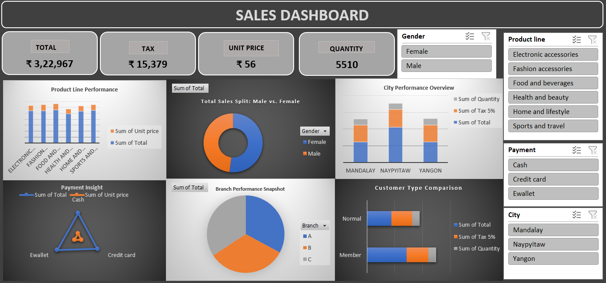

#  Retail Sales Dashboard (Excel)

## 📊 Overview
An interactive Excel dashboard that explores customer behavior, product performance, and payment channel insights across multiple retail branches.  

## 💡 Dashboard Features
-  **KPI Cards**  
  - **Total Sales**  
  - **Tax Collected**  
  - **Unit Price**  
  - **Quantity Sold**

- 📊 **Chart Breakdown**:
  - **Product Line Performance** (Bar chart): Total and Unit Price across six categories  
  - **Gender Split** (Pie chart): Total sales by Male vs Female  
  - **City Overview** (Bar chart): Total, Tax 5%, Quantity across Mandalay, Naypyitaw, Yangon  
  - **Payment Insight** (Radar or custom shape): Total vs Unit Price across Cash, Credit Card, Ewallet  
  - **Branch Snapshot** (Pie chart): Performance of Branches A, B, C  
  - **Customer Type Comparison** (Bar chart): Normal vs Member — Total, Tax 5%, Quantity  

- 🧭 **Slicers**:  
  - **Gender**  
  - **Product Line**  
  - **Payment Method**    
  - **City**

## 📷 Preview

## 📁 Files
- `Retail_Dashboard.xlsx` — Main dashboard file
- `/images` — Folder with screenshots and banner visuals

## 🚀 Purpose
Built to analyze retail transactions and identify performance trends across product lines and customer segments. Designed for quick decision-making and stakeholder presentation.

## 👤 Author
Built and published by [raeeskasim1] 
